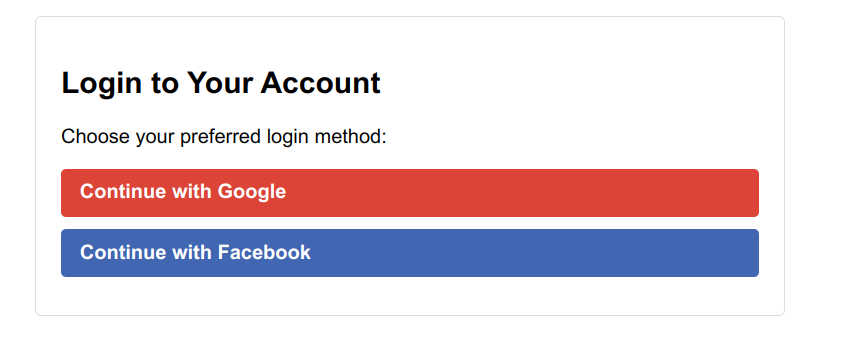
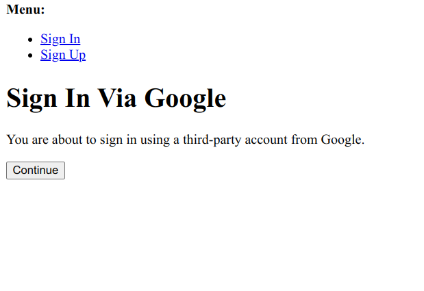
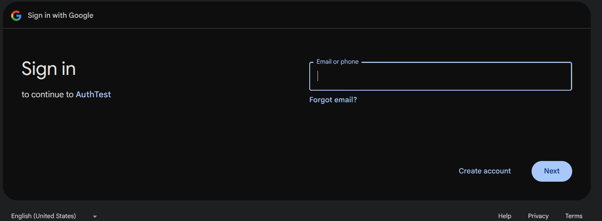
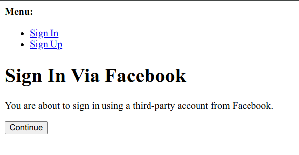
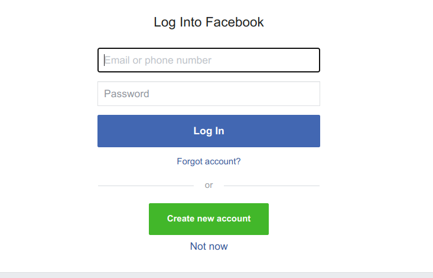

# Django Social Authentication Project


A complete Django project with Google and Facebook authentication using django-allauth.

## Features

✅ Google OAuth2 authentication  
✅ Facebook OAuth2 authentication  
✅ Automatic social app configuration  
✅ REST API endpoints for user information  
✅ Token-based authentication  
✅ Admin interface for user management  

## Complete Setup Guide

### 1. Prerequisites
- Python 3.8+
- Google OAuth2 credentials
- Facebook App credentials

### 2. Project Setup

```bash
# Clone the repository
git clone https://github.com/yourusername/social_auth.git
cd social_auth

# Create and activate virtual environment
python -m venv venv

# On Windows:
venv\Scripts\activate

# On macOS/Linux:
source venv/bin/activate

# Install dependencies
pip install -r requirements.txt

```
### 3. Environment Configuration

#### Create .env file


##### How to get Google and Facebook credentials

###### 1. Google OAuth2 credentials
- Go to the [Google Developer Console](https://console.developers.google.com/).
- Create a new project or use an existing one.
- Navigate to **Credentials** from the sidebar.
- Click **Create Credentials** and select **OAuth 2.0 Client IDs**.
- Under **Authorized redirect URIs**, add:  
  `http://localhost:8000/accounts/google/login/callback/`  
  (This is the URI used by the Django app for Google login).
- After saving, you will see the **Client ID** and **Client Secret**. Copy these values and place them in your `.env` file.

###### 2. Facebook App credentials
- Go to the [Facebook for Developers site](https://developers.facebook.com/).
- Create a new app in the **My Apps** section.
- Under **Facebook Login**, select **Settings**.
- Add `http://localhost:8000` as the **Valid OAuth redirect URIs**.
- You will find your **App ID** and **App Secret** in the **Settings** > **Basic** section. Copy these values and place them in your `.env` file.

Once you have these credentials, your `.env` file should look like:

```
DJANGO_SECRET_KEY=your-django-secret-key-here
GOOGLE_CLIENT_ID=your-google-client-id-here
GOOGLE_CLIENT_SECRET=your-google-client-secret-here
FACEBOOK_APP_ID=your-facebook-app-id-here
FACEBOOK_APP_SECRET=your-facebook-app-secret-here
```


### 4. Database Setup and Run Server
```
python manage.py migrate
python manage.py createsuperuser

python manage.py runserver
```

### 5. Configure Site Domain in Django Admin
After creating the superuser, configure the default site for social login:

- Open your browser and go to the Django admin panel:
    http://localhost:8000/admin/sites/site/ 
- Click on the existing site (usually ID = 1) and update it as follows:

        Domain name: localhost:8000

        Display name: localhost

### 5. Access the login page
Now that everything is set up, navigate to the login page in your browser:

http://localhost:8000/accounts/login/



### On clicking "Continue with Google"



### On clicking "Continue with Facebook"

